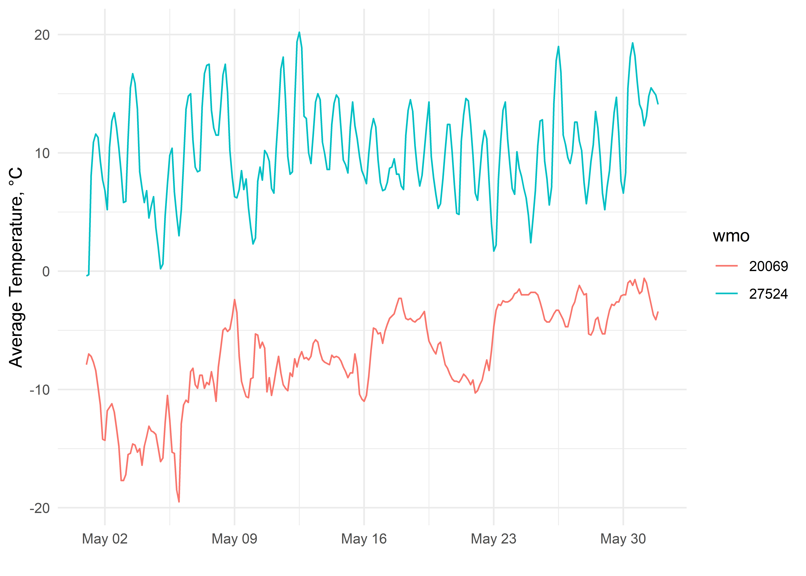

<!-- README.md is generated from README.Rmd. Please edit that file -->

# rp5pik 

<!-- badges: start -->

[](https://doi.org/10.5281/zenodo.8090329)
[](https://lifecycle.r-lib.org/articles/stages.html#experimental)
[](https://github.com/atsyplenkov/rp5pik/actions?query=workflow%3Apkgcheck)
[](https://CRAN.R-project.org/package=rp5pik)


<!-- badges: end -->

The `rp5pik` package provides a set of functions to download and
preprocess meteorological data from <http://www.pogodaiklimat.ru/>

## Installation

You can install the development version of rp5pik from
[GitHub](https://github.com/) with:

``` r
# install.packages("devtools")
devtools::install_github("atsyplenkov/rp5pik")

# OR

# install.packages("remotes")
remotes::install_github("atsyplenkov/rp5pik")
```

## Examples

### 1. Data download

Below is an example for `rp_parse_pik` functions. It allows you to
download meteo data at **3-hour** temporal resolution for various
stations using their WMO ID from <http://www.pogodaiklimat.ru/>:

``` r
library(rp5pik)

example <-
  rp_parse_pik(
    wmo_id = c("20069", "27524"),
    start_date = "2022-05-01",
    end_date = "2022-05-31"
  )
#> ⠙ 1/2 ETA:  4s | Downloading data                                    Parsing data

example
#> # A tibble: 496 × 11
#>    wmo   datetime_utc           ta    td    rh    ps   psl  prec windd
#>    <chr> <dttm>              <dbl> <dbl> <dbl> <dbl> <dbl> <dbl> <int>
#>  1 20069 2022-05-01 00:00:00  -7.9  -9.1    91  993   996.   0.8    90
#>  2 20069 2022-05-01 03:00:00  -7    -8.2    91  994.  997.  NA      90
#>  3 20069 2022-05-01 06:00:00  -7.2  -8.4    91  994.  997.  NA      90
#>  4 20069 2022-05-01 09:00:00  -7.7  -8.8    92  994.  998.  NA      90
#>  5 20069 2022-05-01 12:00:00  -8.4  -9.5    92  995.  998.   0.6    90
#>  6 20069 2022-05-01 15:00:00  -9.8 -11      91  995   998.  NA      45
#>  7 20069 2022-05-01 18:00:00 -11.3 -12.7    89  995.  998.  NA      45
#>  8 20069 2022-05-01 21:00:00 -14.2 -16      86  995.  999.  NA      45
#>  9 20069 2022-05-02 00:00:00 -14.3 -15.9    88  995.  998.  NA      45
#> 10 20069 2022-05-02 03:00:00 -11.8 -14.4    81  994.  997.  NA       0
#> # ℹ 486 more rows
#> # ℹ 2 more variables: winds_mean <dbl>, winds_max <dbl>
```

List of available variables:

- `wmo` character. WMO index of the meteostation

- `datetime_utc` POSIXct. Date and Time of the measurement at UTC

- `ta` numeric. Air temperature at 2m above the surface, °C

- `td` numeric. Dew point, °C

- `rh` numeric. Relative humidity at 2m above the surface, %

- `ps` numeric. Atmosphere pressure at meteostation, hPa

- `psl` numeric. Atmosphere pressure adjusted to the height of mean sea
  level, hPa

- `prec` numeric. Cumulative precipitation for the last 12 hours, mm

- `windd` integer. Wind direction, deg

- `winds_mean` numeric. Average 10-min wind speed, m/s

- `winds_max` numeric. Maximum wind speed, m/s

We can visualize the `example` dataset using `ggplot2` as follows:

``` r
library(ggplot2)

example |> 
  ggplot(
    aes(
      x = datetime_utc,
      y = ta,
      group = wmo
    )
  ) +
  geom_line(aes(color = wmo)) +
  labs(
    x = "",
    y = "Average Temperature, °C"
  ) +
  theme_minimal()
```



### 2. Data preprocessing

Since the downloaded with `rp_parse_pik` data contains raw data, it
requires additional checking and cleaning. We suggest to explore the raw
dataset by yourselves before any further manipulations.

However, the `rp5pik` package has a function to aggregate raw data on
daily (`24h`) or semi-daily (`12h`) periods. The `rp_aggregate_pik`
function removes known error codes from precipitation data (`699`
values). Additionally, it calculates daily precipitation sums based on
measured precipitation at 06 UTC and 18 UTC in European part of Russia
(see [meteostation manuals for more
info](https://method.meteorf.ru/ansambl/pojasnenijaansambl.html)).

⚠ As of 2023-06-28 this function works only with Moscow timezone.

This is how you can aggregate data daily:

``` r
library(dplyr)

example_daily <- 
  example |> 
  rp_aggregate_pik(.period = "24h") |> 
  group_split(wmo)

example_daily
#> <list_of<
#>   tbl_df<
#>     wmo       : character
#>     date      : date
#>     p         : double
#>     ta        : double
#>     td        : double
#>     rh        : double
#>     ps        : double
#>     psl       : double
#>     windd     : double
#>     winds_mean: double
#>     winds_max : double
#>   >
#> >[2]>
#> [[1]]
#> # A tibble: 32 × 11
#>    wmo   date           p     ta     td    rh    ps   psl windd winds_mean
#>    <chr> <date>     <dbl>  <dbl>  <dbl> <dbl> <dbl> <dbl> <dbl>      <dbl>
#>  1 20069 2022-05-01    NA  -8.47  -9.67  91    994.  998.  77.1       9.14
#>  2 20069 2022-05-02    NA -12.9  -14.9   85    992.  995. 129.        6.12
#>  3 20069 2022-05-03    NA -16.0  -19.0   77.8  988.  992. 152.        2.25
#>  4 20069 2022-05-04    NA -14.3  -17.4   77.2  996.  999. 248.        5.38
#>  5 20069 2022-05-05    NA -14.2  -16.0   86.6  998. 1002.  67.5       3.38
#>  6 20069 2022-05-06    NA -12.6  -14.3   87.2  994.  997. 253.        4.12
#>  7 20069 2022-05-07    NA  -9.31 -11.1   86.9  999. 1002. 231.        3.12
#>  8 20069 2022-05-08    NA  -6.88  -8.25  90.1  999. 1003. 152.        9.25
#>  9 20069 2022-05-09    NA  -7.19  -9.02  86.6  991.  995. 202.        9.62
#> 10 20069 2022-05-10    NA  -7.25  -8.89  88    987.  990. 197.        7.75
#> # ℹ 22 more rows
#> # ℹ 1 more variable: winds_max <dbl>
#> 
#> [[2]]
#> # A tibble: 32 × 11
#>    wmo   date           p    ta     td    rh    ps   psl windd winds_mean
#>    <chr> <date>     <dbl> <dbl>  <dbl> <dbl> <dbl> <dbl> <dbl>      <dbl>
#>  1 27524 2022-05-01  NA    7.21 -5.59   43    996. 1023.  238.       3.71
#>  2 27524 2022-05-02   0    9.85 -2.4    44.1  991. 1018.  199.       3   
#>  3 27524 2022-05-03  NA   11.6   1.54   53.9  982. 1008.  231.       5.88
#>  4 27524 2022-05-04   0.6  6    -1.14   60.5  985. 1012.  298.       5.25
#>  5 27524 2022-05-05  NA    5.24 -6.68   45.5  997. 1025.  248.       3.75
#>  6 27524 2022-05-06  NA    9.59 -5.91   34.2 1001. 1028.  191.       3.5 
#>  7 27524 2022-05-07  NA   13.1  -2.59   34.2  999. 1025.  180        3.62
#>  8 27524 2022-05-08   1   13.6   2.17   47.8  992. 1019.  208.       4.75
#>  9 27524 2022-05-09   2.6  6.99  0.575  64.2  994. 1021.  158.       6.25
#> 10 27524 2022-05-10   0    6.62 -3.5    50.6  992. 1019.  158.       7.38
#> # ℹ 22 more rows
#> # ℹ 1 more variable: winds_max <dbl>
```

Or semi-daily:

``` r
library(dplyr)

example_12h <- 
  example |> 
  rp_aggregate_pik(.period = "12h", .tz = "Europe/Moscow") |> 
  group_split(wmo)

example_12h
#> <list_of<
#>   tbl_df<
#>     wmo        : character
#>     datetime_tz: datetime<Europe/Moscow>
#>     p          : double
#>     ta         : double
#>     td         : double
#>     rh         : double
#>     ps         : double
#>     psl        : double
#>     windd      : double
#>     winds_mean : double
#>     winds_max  : double
#>   >
#> >[2]>
#> [[1]]
#> # A tibble: 63 × 11
#>    wmo   datetime_tz             p     ta     td    rh    ps   psl windd
#>    <chr> <dttm>              <dbl>  <dbl>  <dbl> <dbl> <dbl> <dbl> <dbl>
#>  1 20069 2022-05-01 09:00:00    NA  -7.37  -8.57  91    993.  997.  90  
#>  2 20069 2022-05-01 21:00:00    NA  -9.3  -10.5   91    995.  998.  67.5
#>  3 20069 2022-05-02 09:00:00    NA -13.0  -15.0   84.8  994.  997.  22.5
#>  4 20069 2022-05-02 21:00:00    NA -12.8  -14.8   85.2  989.  993. 236. 
#>  5 20069 2022-05-03 09:00:00    NA -17.0  -19.7   79.8  987.  990.  90  
#>  6 20069 2022-05-03 21:00:00    NA -15    -18.4   75.8  990.  993. 214. 
#>  7 20069 2022-05-04 09:00:00    NA -15.0  -18.6   74.5  993.  997. 248. 
#>  8 20069 2022-05-04 21:00:00    NA -13.5  -16.2   80    998. 1001. 248. 
#>  9 20069 2022-05-05 09:00:00    NA -14.9  -16.6   86.8 1000. 1003. 124. 
#> 10 20069 2022-05-05 21:00:00    NA -13.4  -15.3   86.5  997. 1000.  11.2
#> # ℹ 53 more rows
#> # ℹ 2 more variables: winds_mean <dbl>, winds_max <dbl>
#> 
#> [[2]]
#> # A tibble: 63 × 11
#>    wmo   datetime_tz             p    ta    td    rh    ps   psl windd
#>    <chr> <dttm>              <dbl> <dbl> <dbl> <dbl> <dbl> <dbl> <dbl>
#>  1 27524 2022-05-01 09:00:00  NA    2.47 -5.27  59.3  998. 1026.  225 
#>  2 27524 2022-05-01 21:00:00  NA   10.8  -5.82  30.8  995. 1022.  248.
#>  3 27524 2022-05-02 09:00:00  NA    7.55 -1.58  53    993. 1020.  195 
#>  4 27524 2022-05-02 21:00:00   0   12.2  -3.22  35.2  990. 1016.  202.
#>  5 27524 2022-05-03 09:00:00  NA    7.8   3.22  73.2  985. 1011.  214.
#>  6 27524 2022-05-03 21:00:00  NA   15.4  -0.15  34.5  980. 1006.  248.
#>  7 27524 2022-05-04 09:00:00   0.3  7     0.55  63.5  982. 1009.  292.
#>  8 27524 2022-05-04 21:00:00   0.3  5    -2.82  57.5  988. 1015.  304.
#>  9 27524 2022-05-05 09:00:00  NA    1.9  -4.85  62    996. 1023.  315 
#> 10 27524 2022-05-05 21:00:00  NA    8.58 -8.5   29    999. 1026.  180 
#> # ℹ 53 more rows
#> # ℹ 2 more variables: winds_mean <dbl>, winds_max <dbl>
```

## Roadmap

    rp5pik 📦
    ├── Parser functions for
    │   ├── pogodaiklimat
    │   │   ├── rp5pik::rp_parse_pik ✅
    │   │   └── rp5pik::rp_aggregate_pik ✅
    │   ├── rp5 🔲
    │   └── gmvo.skniivh 🔲
    ├── WMO stations coordinates  🔲
    └── Rain/Snow guessing  
        └── rp5pik::rp_get_temp50 ✅
